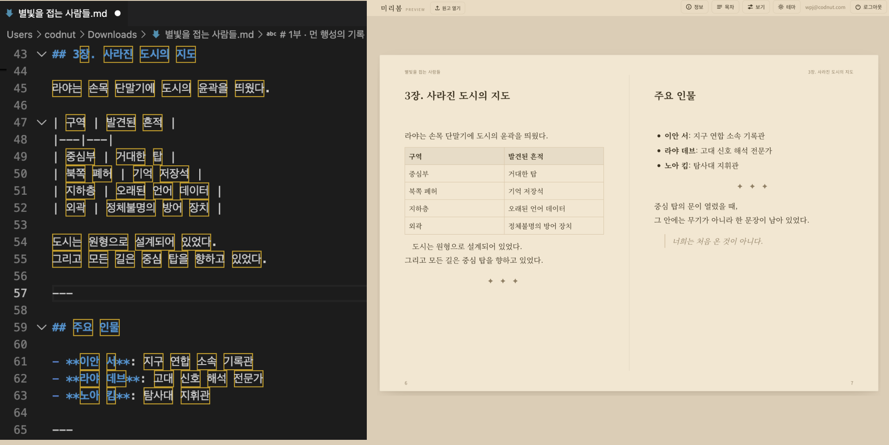
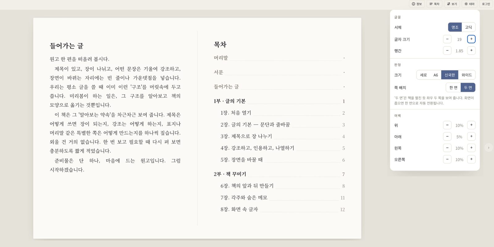
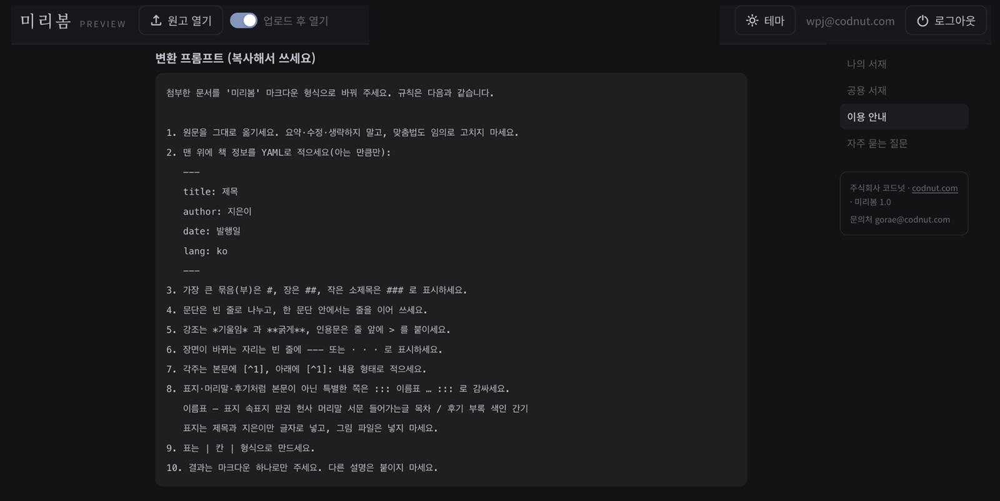

# 미리봄

**마크다운을, 책처럼 읽다.** 표지·차례·각주·쪽번호가 갖춰진 전자책처럼 보여 주는 마크다운 뷰어.
_Read your Markdown like a book._

왼쪽 마크다운이 오른쪽처럼 — 표·각주·장면 전환·인용까지 한 권의 책으로.

→ 바로 써보기(설치·가입 없이): **https://mirivom.com**

---

마크다운으로 쓴 글이든, 누군가 보낸 `.md` 파일이든, 미리봄에 열면 표지·차례·각주·쪽번호가 갖춰진 책이 됩니다. 에디터에서는 가늠하기 어려운 글의 리듬과 분량을 독자가 읽을 모습 그대로 보고, 데스크톱에서도 모바일에서도 편하게 정독합니다.

## 특징

- **마크다운을 책처럼** — 표지·차례·각주·쪽번호. 데스크톱에서도, 모바일에서도 정독.
- **내 취향대로 읽기** — 테마, 글꼴(명조·고딕), 판형(신국판·A6·와이드), 한 면/두 면, 여백까지 조절.
- **로그인 없이 바로 변환** — 파일을 열면 끝. 가입이 필요 없습니다.
- **빠른 비공개 공유** — 링크 하나면, 받는 사람은 메모장이 아니라 책을 읽습니다.
- **서버 없는 조판** — 마크다운 파싱·책 조판·페이지네이션 전부 브라우저에서.
- **열려 있음** — MIT. 파일 하나라 포크도 자체 호스팅도 쉽습니다.

명조·고딕, 판형, 한 면/두 면, 여백까지 — 좁은 화면에서는 자동으로 한 면으로.

## 두 가지로 쓸 수 있어요

**제대로 — 호스팅판 (mirivom.com)**
계정·내 서재·표지·비공개 공유까지, 최신 기능은 모두 여기 있습니다. **https://mirivom.com** 에서 바로 쓰면 됩니다.

**가볍게 — 단일 파일 기본 뷰어 (로컬)**
설치·가입·서버 없이, HTML 파일 하나를 브라우저로 열면 끝. 원고가 브라우저 밖으로 나가지 않습니다. 표지 업로드·내 서재·공유 같은 최신 기능은 없는 **기본 뷰어**지만, 마크다운을 책처럼 읽는 핵심은 그대로입니다.
→ [바로 열기](https://mirivom.com/legacy/index.html) · 이 파일(`legacy/index.html`) 하나만 저장하면 오프라인에서도 동작합니다.

## 어떻게 동작하나

- **단일 HTML 파일, 빌드 없음.** 번들러도 프레임워크도 없습니다. 파일 하나 열면 그대로 동작.
- **전부 브라우저에서.** 마크다운 파싱, 책 조판, CSS 다단 페이지네이션까지 클라이언트에서 — 서버 없이 진짜 '책 페이지'가 나옵니다.
- **백엔드는 Supabase** — 인증·DB·스토리지, 데이터는 RLS로 보호. 호스팅은 GitHub Pages.
- **포크 친화적.** MIT라 가져다 고치고 자체 호스팅하기 쉽습니다.

## format.md

`format.md`는 미리봄의 마크다운 형식 안내서입니다. 이 파일을 챗봇에게 주면 일반 텍스트를 미리봄 형식의 마크다운으로 정리해 줍니다. → [format.md](./format.md)

## 직접 호스팅 (셀프호스트)

자체 Supabase로 호스팅하려면:

1. Supabase 프로젝트를 만들고, `config.example.js`를 `config.js`로 복사해 Project URL·anon(publishable) key를 채웁니다.
2. `supabase/migrations`의 SQL을 번호 순서대로 적용합니다(대시보드 SQL Editor 또는 `supabase db push`).
3. Authentication에서 이메일 로그인을 켭니다.
4. 정적 호스팅(GitHub Pages 등)에 올리면 끝. 앱 진입점은 `app/index.html`입니다.

## 피드백·기여

버그나 기능 요청은 **Issues**로, 이야기·아이디어는 **Discussions**로 남겨 주세요. 천천히, 하지만 꼭 읽습니다.

미리봄은 코드넛이 만들고 운영합니다. 뒷이야기는 블로그에 → [blog.codnut.com](https://blog.codnut.com)

## 라이선스

MIT © 2025 gorae@codnut.com
