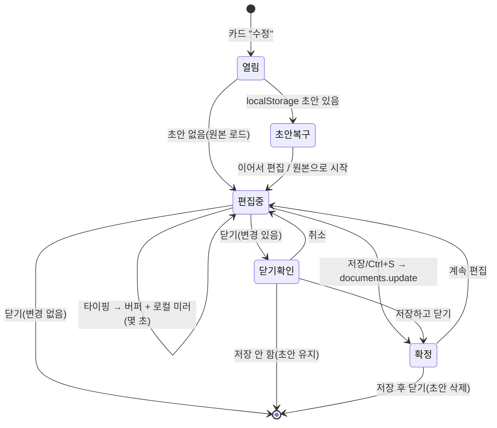

# 미리봄 3차 업데이트 — 통합 개발기획서 (검증판)

> 작성일 2026-06-22 · 대상: 구현(Claude Code) / 검토(고래) · 기준 커밋 `167f4ee`(main)
> 출처: `미리봄-3차업데이트-기술구현-기획서.md` + `미리봄-편집기-기획서.md` 두 문서를 통합하고, **실제 코드(`app/index.html`·`supabase/migrations/`)와 대조 검증**해 빈틈을 메운 단일 기획서.
> **전제: 이 문서는 설계·검증만. 소스 구현은 이 문서 확정 후 단계적으로 진행한다.**

---

## 0. 범위와 관통 원칙

| # | 기능 | 한 줄 정의 |
|---|---|---|
| ① | **인라인 편집기** | 대시보드에서 띄우는 가벼운 마크다운 편집기(라이브러리 0). 머리말·오타 교정용 |
| ② | **공용 서재(쇼룸)** | 작가가 공개 선택한 원고의 큐레이션 진열장 |
| ③ | **공유 현황** | 내가 공유한 것·만료·열람 로그를 모아 보는 저자 대시보드 |

**관통 원칙**: 단일 파일(`app/index.html`)·빌드 없음·Supabase BaaS·GitHub Pages 정적 호스팅 유지 / `shares`에서 검증된 **동결 스냅샷** 패턴을 `public_works`에 재사용 / 실데이터 공개·공유 전 **RLS 격리 자동 테스트** 통과(6장) / 검열·분석·랭킹 등 손 가는 것은 v1 제외(9장).

---

## 1. 검증 결과 — 실제 코드와 대조 (이 문서의 핵심)

두 기획서를 코드와 대조해 **실제로 동작하는지** 확인했다. ✅ 확인된 전제와, ⚠️ 두 문서가 놓친 문제 + 해결을 함께 적는다.

### ✅ 확인된 전제 (그대로 가도 됨)
- **편집기 폼 ↔ YAML 1:1**: `buildAutoFront()`(`index.html:1561`)가 실제로 읽는 키 = `cover-image, title, subtitle, author, publisher, date, identifier, rights`. 폼 7필드(title·subtitle·author·publisher·date·identifier·rights)와 정확히 일치. ✔
- **편집기 새 RLS 불필요**: `documents.update`는 기존 `documents_owner_all`(`owner_id=auth.uid()`)이 막음. ✔
- **동결 스냅샷 재사용**: `create_share_link`(`migrations/...0004`)의 "제목·본문 동결 복사" 패턴이 `public_works`에 그대로 이식 가능. ✔
- **공유 현황은 surfacing**: `share_access_events` + `access_events_select_owner`(소유자만) 이미 존재 → 새 백엔드 0. ✔
- **③은 내가(Claude) 실행 검증 가능**: anon 키만으로 데이터-평면 RLS 테스트 가능(아래 6장).

### ⚠️ 두 문서가 놓친 문제 + 해결

**[검증-1] 편집기 YAML 왕복 시 데이터 손실 (중요)**
`parseYAML()`(`index.html:1327`)은 `^([A-Za-z_-]+)\s*:\s*(.*)$` 로 **매칭되는 모든 키**를 `meta`에 담는다 — 폼 7필드뿐 아니라 `lang`, `cover-image`, 작가가 임의로 쓴 키(`series` 등)까지. 편집기가 **폼 7필드만 직렬화**해 저장하면 `lang`·`cover-image`·커스텀 키가 **사라진다.**
- **해결**: 편집기는 파싱한 `meta` 전체를 보관하고, 저장 시 **(a) 폼이 다루는 키는 폼 값으로 갱신, (b) 폼이 모르는 키는 원본 그대로 보존**해 전체를 재직렬화한다. "값 있는 키만 기록"(빈 머리말 방지)도 동일 직렬화기에서 처리.
- **직렬화 규칙**: 값에 앞뒤 공백·따옴표·`#` 선두 등이 있으면 따옴표로 감싸 round-trip 보장. (parseYAML이 따옴표를 벗기므로 대칭 유지)

**[검증-2] 편집기 미리보기 — 페이지 튐 + 스피너 깜빡임 (중요)**
미리보기는 `__MV.loadManuscript()` 재호출인데, 이 함수는 매번 ① `STATE.page=0`으로 리셋(`index.html:1619`) ② 로딩 스피너 표시(`원고를 펼치는 중…`)를 한다. 디바운스만으로는, 5장을 편집 중인데 **미리보기가 매번 표지(0쪽)로 튀고 스피너가 깜빡인다.**
- **해결**: `loadManuscript`에 **조용한 미리보기 모드**를 추가(`opts.quiet`): 스피너 생략 + 재조판 후 **직전 페이지 복원**(`STATE.page`를 새 `pageCount`로 클램프). 편집기는 미리보기 전 현재 쪽을 저장→복원. (이상적으로는 커서 근처 블록의 쪽으로 이동하되, v1은 "직전 쪽 유지"로 충분.)

**[검증-3] 미리보기 임베드 — 단일 뷰어 인스턴스 공유 (구조)**
뷰어는 `__MV` 하나 + `.stage > .book` DOM 하나뿐. 편집 오버레이의 오른쪽 미리보기는 **이 실물 스테이지를 빌려** 쓴다(두 번째 렌더러 금지).
- **해결**: 편집기 열면 오버레이가 전면을 덮고, 오른쪽 칸에 기존 `.stage`를 배치(레이아웃/리페어런팅), 왼쪽은 편집 패널. 편집 중 `body.doc-open`·`#dashboard`·`#empty` 표시 충돌을 오버레이가 관리하고, **닫을 때 뷰어 상태를 원복**한다. (구현 단계에서 show/hide 상호작용을 실제 검증 — 6장 체크리스트)

**[검증-4] 공개본 작가소개 — profiles RLS 구멍 (중요)**
②는 `profiles.bio/link`를 공개 원고 하단에 보여주려 하지만, `profiles` RLS는 **본인만 select**(`profiles_select_own`, `migrations/...0002`). → **익명 방문자는 남의 작가소개를 못 읽는다.** 그대로 두면 공개 페이지에 작가소개가 안 뜬다.
- **해결(택1, 8장에서 결정)**:
  - (A) **공개본에 작가 정보 동결**: 공개 시점 `display_name·bio·link`를 `public_works`에 같이 복사(동결 철학과 일치, RLS 추가 0). bio 수정은 재공개 때 반영.
  - (B) **profiles 공개 읽기 정책**(공개 원고 보유 작가에 한정): `exists(public_works where owner_id=profiles.id and is_active)` 조건의 anon select. 항상 최신 bio. 정책 1개 추가.
  - **권장: (A)** — 동결 철학과 일관, RLS 표면 최소.

**[검증-5] "동결 표지"는 진짜 동결이 아님 (주의)**
`content_md`는 텍스트를 복사하므로 진짜 동결이지만, `cover_path`는 `covers/{uid}/{docid}/display.jpg` **경로 참조**다. 표지를 교체하면 같은 경로 객체가 덮어써져, 이미 만든 공유/공개본도 **새 표지로 바뀐다.** 원본을 삭제하면 객체가 지워져 **표지가 깨진다**(공개본은 cascade로 행도 삭제되니 무방, 공유본은 행이 남아 404 가능).
- **해결(v1)**: "표지는 항상 최신 반영"을 수용하고 도움말 1줄. 진짜 동결이 필요하면 공개 시 표지 객체를 `public/{slug}.jpg`로 **복사**(후속 과제). 공유본 표지 404는 뷰어가 자동표지로 폴백하도록 `buildBleed`에 `onerror` 처리(작은 보강).

**[검증-6] ② SEO 가치는 대부분 v2(정적화)에 있음 — 정직하게**
②의 마케팅·검색 노출 효과는 **공개본이 검색에 잡혀야** 생긴다. 그런데 v1은 CSR(자바스크립트 렌더)이라 색인이 약하다. 제대로 된 SEO는 **공개본을 정적 HTML로 생성(v2)**해야 하는데, 이는 **"빌드 없음" 원칙과 충돌**한다.
- **해결**: v1은 CSR 서가로 출시(기능·보상 가치). **정적화는 별도 빌드 스텝**으로 명시 분리(GitHub Actions로 공개본→정적 HTML 생성). "빌드 없음"은 **앱 본체** 원칙으로 좁히고, 공개본 정적 생성은 예외로 문서화. v2 착수 전 비용/효과 재평가.

**[검증-7] "보안 테스트 게이트"의 실행 수단이 없음 (중요)**
두 문서는 "실데이터 전 RLS 테스트 통과"를 게이트로 두지만, 현재 프로젝트엔 **그걸 돌릴 인프라가 없다**(`?selftest=1`은 조판용 클라이언트 테스트, 인증 무관). DDL 적용은 service 키가 없어 **사용자(고래)가 SQL Editor로** 하지만, **데이터-평면 RLS 테스트는 anon 키만으로 가능** → 6장에 **Node 스크립트(`scripts/rls-test.mjs`)**로 구체화. (내가 직접 실행 가능)

---

## 2. 데이터 모델 변경 (확정안)

새 마이그레이션으로만 추가. **DDL은 고래가 SQL Editor에 적용**(service 키 없음). `create or replace`/`if not exists`로 재실행 안전하게 작성.

### 2-1. `public_works` (공용 서재 공개본) — `migrations/...0008_public_works.sql`
| 컬럼 | 타입 | 비고 |
|---|---|---|
| `id` | uuid PK | |
| `document_id` | uuid FK→documents | **on delete cascade** |
| `owner_id` | uuid FK→auth.users | cascade |
| `slug` | text UNIQUE | 공개 URL용(`?work=slug`). 추측 가능 무방(공개 콘텐츠) |
| `title`·`content_md`·`cover_path` | text | 공개 시점 **동결 복사** |
| `category` | text | 고정 집합(`에세이`·`기술`·`소설`·`기타`) 중 1 |
| `author_name`·`author_bio`·`author_link` | text null | **[검증-4(A)] 작가 정보 동결 복사** |
| `is_active` | boolean | 회수 시 false |
| `created_at`·`updated_at` | timestamptz | `updated_at` = 공개본 갱신 시각 |

**RLS**: `public_works_anon_select`(누구나 `is_active=true` select) · `public_works_owner_all`(소유자만 insert/update/delete).
**공개 RPC(권장)**: `publish_work(p_document_id, p_category, p_slug)` = 소유 확인 → 본문·표지·작가정보 동결 복사 insert(또는 upsert로 "갱신"). `create_share_link`와 같은 SECURITY DEFINER 패턴. 슬러그 중복 처리 포함.

### 2-2. `profiles` 확장 — `migrations/...0009_profiles_bio.sql`
`bio text null`, `link text null` 추가. 기존 `profiles_update_own`가 수정 권한 커버. **공개 노출은 [검증-4] 결정에 따름**(권장 A=동결이면 profiles 공개 정책 불필요).

---

## 3. ① 인라인 편집기 (상세 설계)

### 3-1. 화면
대시보드 위 **전체화면 분할 오버레이**. 왼쪽 편집 패널 / 오른쪽 읽기 전용 미리보기(기존 `.stage` 재사용 — [검증-3]).
```
┌──────────── 편집 오버레이 ────────────┐
│ [상태: 저장됨·방금 / 수정함·저장안됨]  [저장] [닫기] │
├──── 편집(좌) ────┬──── 미리보기(우) ────┤
│ ▸ 책 정보 폼      │  기존 .book 스테이지 │
│   제목/부제/저자/  │  __MV.loadManuscript │
│   출판사/발행일/   │  (quiet + 쪽 복원)   │
│   식별자/판권      │                      │
│ ─────────────── │                      │
│ ▸ 본문 textarea   │                      │
│   (한글 IME 네이티브)│                    │
└──────────────────┴──────────────────────┘
```
모바일: 분할 대신 `편집/미리보기` 탭 토글.

### 3-2. 책 정보 폼 (주 기능)
- 폼 7필드 ↔ YAML 키 1:1(1장 ✅). 작가가 YAML을 직접 안 만지게.
- **[검증-1]** 파싱한 `meta` 전체 보관 → 저장 시 폼 키만 갱신, 미지 키(`lang`·`cover-image`·커스텀) 보존, 값 있는 키만 직렬화, 필요한 값은 따옴표 처리.
- **예외**: 작가가 본문에 `::: 표지`/`::: 판권`을 직접 썼으면 그 블록이 우선(파서 `existing` 집합이 자동 머리말 억제). 폼은 YAML만 다루고, 그 블록은 본문 textarea에서 수정. → 폼 author를 고쳐도 미리보기가 안 변할 수 있음을 **작은 안내**로.

### 3-3. 본문 textarea
오타 교정용 순수 `<textarea>` 하나(의존성 0, 한글 IME 네이티브). 이미지·링크 툴바 없음(인라인 ``는 뷰어에서 플레이스홀더).

### 3-4. 표지 이미지 (별도 즉시 경로)
폼 텍스트와 무관. 기존 흐름 재사용: 선택→canvas 리사이즈(1600/500)→`covers` 업로드→`cover_path`/`cover_thumb_path` 갱신. **텍스트 저장과 별개로 즉시 반영** → 표지 버튼 옆 "표지는 바로 저장됨" 안내.

### 3-5. 저장 모델 (작업 버퍼 ↔ DB 원본 분리)

- **확정은 명시적으로만**(저장/Ctrl+S → `documents.update({content_md, title})`). 그 전 DB 불변.
- **로컬 초안**: `localStorage`(문서 id 키)에 몇 초마다 미러(크래시·실수닫힘 대비). 삭제 시점 = 저장 성공 / "원본으로 시작"·"버리기" / **로그아웃**(미공개 텍스트 잔존 방지).
- **닫기 3갈래**(변경 시): 저장하고 닫기 / 저장 안 하고 닫기 / 계속 편집.
- **상태표시**: `저장됨·방금` ↔ `수정함·저장안됨`.
- 저장 시 `extractTitle` 재실행 → 카드 제목·자동표지색 갱신(제목 기준 `colorIdx`/`deepColor` — 의도된 동작).

### 3-6. 미리보기 렌더 ([검증-2] 반영)
폼/본문 변경 → 디바운스(~500ms) → 머리말 재직렬화+본문 합본 → `assemble()` → `loadManuscript(md, coverUrl, colorKey, {quiet:true})`. **quiet = 스피너 생략 + 직전 쪽 복원**. 긴 원고에서 부족하면 "수동 새로고침" 토글(후속).

### 3-7. 진입점
카드 롤오버에 **✎ 수정** 추가(현재 5버튼 → 6버튼). 터치는 `⋯` 메뉴 안.

---

## 4. ② 공용 서재 (상세 설계)

### 4-1. 방향
공개 연재 플랫폼이 아니라 **큐레이션 진열장**(마케팅 storefront + 작가에게 영구 공개 페이지 보상). 자유 셀프공개·탐색·랭킹·댓글 없음(9장).

### 4-2. 공개/갱신/회수
- **공개**: `publish_work` RPC → 그 시점 본문·표지·작가정보 동결 복사로 `public_works` 행 생성(`is_active=true`, 만료 없음, `category`·`slug`).
- **갱신**: 동결이라 원본 수정이 자동 반영 안 됨 → **"공개본 갱신"** 버튼으로 다시 굳힘(반쯤 고친 초고 색인 사고 방지 + 수정 편의). 구현 = 같은 RPC upsert.
- **회수**: `is_active=false`(또는 삭제). 원본 삭제 시 **cascade로 공개본도 사라짐**.
- **안내**: "공개하면 검색에 노출될 수 있어요. 언제든 내릴 수 있습니다." + 약관 1줄(내려도 외부 캐시·복제는 재크롤링 전까지 시차).

### 4-3. 카테고리·읽기·라우팅
- 카테고리: 고정 집합 1개 선택 → 서가 상단 필터 탭(클라이언트 필터, `public_works.category`).
- 서가: `showPage('public')`(현재 "준비 중" 자리)을 실 그리드로 — `public_works.select().eq('is_active',true)` → 기존 카드 UI.
- **[검증-6] 읽기 라우팅(신규)**: 공개 원고 주소 = `…/app/index.html?work=<slug>`. 앱이 `?work=`를 감지(공유 `?t=` 패턴 미러) → anon이 `public_works.select().eq('slug',…)` → `__MV.loadManuscript`(이름 게이트 없음, 익명 공개).

### 4-4. 작가 소개 ([검증-4])
공개 원고 하단 "글쓴이 소개" = 동결 복사한 `author_name`·`author_bio`·`author_link`(권장 A). v1은 한 단락 + 링크 한 줄. 팔로우·피드 없음.

### 4-5. SEO ([검증-6] 정직)
- 비공개 원고 noindex 유지. 노출 대상은 공개본뿐.
- **v1**: CSR 서가(색인 약함, 기능·보상 우선).
- **v2(후속·빌드 예외)**: 공개본 → 정적 HTML 생성(GitHub Actions) → 색인. 동결이라 정적화 궁합 좋음. 착수 전 비용/효과 재평가.
- 콘텐츠 수렴: "마크다운 글쓰기 즐거움" 류 마케팅 글을 미리봄 책으로 공개 = 진열품+콘텐츠+SEO 동시.

### 4-6. 초기 큐레이션
오픈 시 고래가 **저작권 없는 글로** 시드(사용설명서·본인 SF단편·동의받은 합평작). 큐레이션 = 고래 승인제(품질 + 검열부담 최소). 자유 업로드 수천보다 잘 고른 몇 권.

---

## 5. ③ 공유 현황 (저자 대시보드)

### 5-1. 정의 — surfacing
재료 완비(`shares` + `share_access_events` + `access_events_select_owner`). 새 백엔드 0, 화면만 추가.

### 5-2. 화면(사이드메뉴 "공유 현황")
- **무엇을 공유했나**: 원고별로 활성·만료·회수 공유를 표지·제목과 목록.
- **언제 닫히나**: "3일 후 자동으로 닫힘" / "닫힘·6/20". **자동 만료**와 **내가 회수**를 구분.
- **누가 언제 읽었나**: 공유별 열람기록(이름+시각). 재방문도 새 행 → **사람 수와 횟수 분리**("5명이 8번 열람"). 클라이언트 집계.
- 회수 버튼(`is_active=false`) 그대로. (선택) 메뉴에 "새 열람 N" 배지.

### 5-3. 표시 규칙 (오해 방지)
- 이름 게이트(방문자): "이름은 식별용이며 **어떤 텍스트로도 입장 가능**"을 공지(인증 아님).
- 열람 로그(작가): 이름은 방문자가 친 값 → **가명·중복 가능, 확정 증거 아님(참고용)** 표기.
- 기록은 **열람 시작(이름 제출)** 시점(완독·체류 아님).
- **IP·user_agent는 작가 화면에 노출하지 않음**(방문자 개인정보, 이름+시각이면 충분).

### 5-4. 쿼리 메모(검증)
소유자가 `shares.select().eq('owner_id',uid)` → 그 `id` 목록으로 `share_access_events.select().in('share_id',ids)`. `access_events_select_owner`가 통과시킴(확인). 2쿼리 + JS 집계.

---

## 6. 보안 · 검증 게이트 (구체 메커니즘) — [검증-7]

원칙: **실원고 공개/공유 전, RLS 격리 자동 테스트가 먼저 green.** DDL은 고래가 적용하지만, 데이터-평면 테스트는 **anon 키로 Claude가 실행**한다.

### 6-1. 테스트 수단 — `scripts/rls-test.mjs` (Node + supabase-js)
- 입력: `.env`의 `SUPABASE_URL`·`SUPABASE_ANON_KEY`.
- 동작: 테스트 계정 2개(A·B, 이메일 가입) 생성/로그인 → 아래 매트릭스 assert → 결과 PASS/FAIL 출력. (CI 없음 → 마이그레이션 적용 후 수동 `node scripts/rls-test.mjs`)
- 정리: 테스트 데이터 best-effort 삭제(소유자 권한 내).

### 6-2. 단언 매트릭스
| 영역 | 단언 |
|---|---|
| 편집기 ① | 비로그인이 임의 문서 update 불가 / B가 A 문서 update 불가 |
| 공용 서재 ② | anon이 `is_active` 공개본 read 가능 / anon·타계정이 **비공개 `documents` read 불가** / 타계정이 남 원고 공개(insert)·회수(delete) 불가 / 원본 삭제 시 공개본 cascade 소멸 |
| 공유 현황 ③ | 소유자만 `share_access_events` read(회귀) / 타계정이 남 공유로그 read 불가 |

### 6-3. 클라이언트 회귀(기존 `?selftest=1` 확장)
- 편집기: **한글 조합 입력 중 로컬 미러가 글자를 끊지 않음**(IME 중 자동저장 타이밍) / 긴 원고 디바운스 비버벅 / 초안 복구·로그아웃 정리 / 미리보기 쪽 복원([검증-2]).
- 미리보기 임베드 show/hide 원복([검증-3]).

---

## 7. 개발 순서 · 단계 (staged)

각 단계는 **독립 배포 가능**하고 끝에 검증을 둔다. 순서는 "가벼운 신뢰 → 품질 → 큰 마케팅".

| 단계 | 내용 | 산출물 | 검증 |
|---|---|---|---|
| **P0** | 검증 인프라 | `scripts/rls-test.mjs`(기존 RLS 회귀부터) | 현행 정책 green |
| **P1 = ③** | 공유 현황 | 사이드메뉴 화면(목록·만료·열람·회수)·표시규칙 | ③ 매트릭스 + 화면 |
| **P2 = ①** | 인라인 편집기 | 오버레이·폼(검증-1)·저장모델·초안·미리보기(검증-2/3) | ① 매트릭스 + IME·초안·쪽복원 |
| **P3 = ②(백엔드)** | `public_works`·`profiles` 마이그·`publish_work` RPC·RLS | 마이그 2개(고래 적용) | ② 매트릭스 + cascade |
| **P4 = ②(프론트)** | 공개/갱신/회수·서가·`?work=` 읽기·작가소개 | 서가·라우팅·안내문구 | 익명 공개읽기·비공개 격리 |
| **P5 = ②(SEO·후속)** | 공개본 정적 HTML 생성(빌드 예외) | Actions 파이프라인 | 색인·정적 산출 |

> ①을 ② 앞에 두는 이유: 공용 서재에 올리기 전 원고를 편집기로 다듬는 흐름이 자연스럽다. P3 마이그레이션은 고래의 SQL 적용이 필요하므로 P2까지는 적용 대기 없이 진행 가능.

---

## 8. 미해결 결정 (고래가 정할 것)

1. **[검증-4] 작가소개 노출 방식**: (A) 공개본에 작가정보 동결(권장) / (B) profiles 공개읽기 정책.
2. **카테고리 집합 확정**: `에세이·기술·소설·기타`? 가감?
3. **안내 문구 확정**: 공개 경고 / 이름 게이트 공지 / 열람로그 캐비엇 / "표지는 최신 반영"([검증-5]).
4. **초기 큐레이션 원고 선정**(저작권 없는 것).
5. **편집기 ✎ 위치·아이콘**, 폼 라벨, 3갈래·초안복구 문구.
6. **[검증-6] ② v1을 CSR로 먼저 낼지**, 정적화(v2)를 어느 시점에.

## 9. 안 하는 것 (스코프 가드)
- 편집기: 이미지·링크 삽입 UI, 사본/복제, WYSIWYG, 협업·버전 히스토리.
- 공용 서재: 탐색·검색·랭킹·추천, 댓글·좋아요·팔로우·피드, 자유 셀프공개, 본격 열람분석. (정적 SEO는 v2.)
- 공유 현황: 체류시간·스크롤·히트맵, IP/UA 노출.

---

## 부록 — 변경 파일 체크리스트
- `supabase/migrations/...0008_public_works.sql` — 테이블 + RLS + `publish_work` RPC.
- `supabase/migrations/...0009_profiles_bio.sql` — `bio`·`link`(+[검증-4] 결정에 따른 정책).
- `scripts/rls-test.mjs` — RLS 격리 테스트(신규 인프라).
- `app/index.html`
  - 파서: `parseYAML` 역직렬화기 신규(미지 키 보존·따옴표) — [검증-1].
  - 뷰어: `loadManuscript`에 `quiet`(스피너 생략·쪽 복원) — [검증-2], `buildBleed` 표지 onerror 폴백 — [검증-5].
  - 대시보드: 카드 ✎ 수정 + 편집 오버레이(①), 사이드메뉴 **공유 현황**(③)·**공용 서재** 실 그리드(②), `?work=slug` 읽기 모드(②), 작가소개 표시.
- (후속) `.github/workflows/*` — 공개본 정적 생성(빌드 예외, v2).

> 키 진입점(재사용): 파서 `assemble()`·`parseYAML()` · 뷰어 `__MV.loadManuscript()` · 동결 패턴(`create_share_link`→`publish_work`) · 로그 `share_access_events` · 표지 `covers` 버킷 · 라우팅 `?t=`(공유)→`?work=`(공개).
