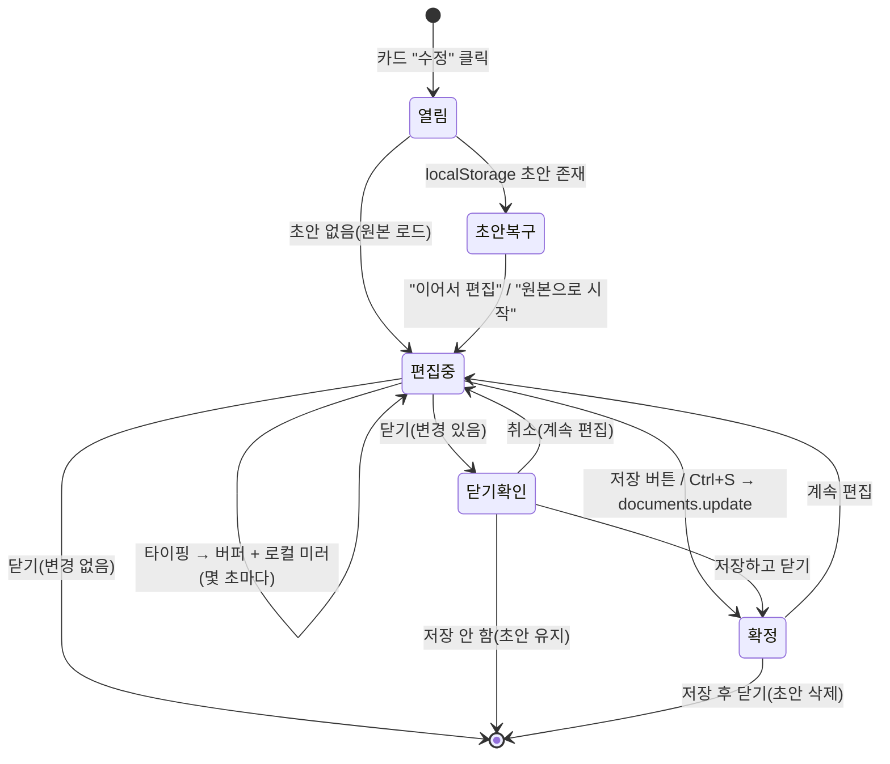

# 미리봄(Miribom) 3차 업데이트 — 기술구현 기획서

> 작성일 2026-06-22 · 대상: 구현(Claude Code) / 검토(고래) · 기준: 운영 앱 `app/index.html` + Supabase
> 한 줄 요약: 미리봄에 **① 인라인 편집기 · ② 공용 서재(큐레이션 쇼룸) · ③ 공유 현황(저자 대시보드)** 세 갈래를 더한다. 외부 라이브러리·새 호스팅 없이 단일 파일 + Supabase RLS + 정적 호스팅 원칙을 유지하고, 이미 있는 **동결 스냅샷** 구조를 최대한 재사용한다.
> 전제: **이번 문서는 기획만**이며 오늘 구현하지 않는다.

---

## 0. 이번 업데이트 범위 (한눈에)

| # | 기능 | 한 줄 정의 | 핵심 가치 |
|---|---|---|---|
| ① | **인라인 편집기** | 대시보드에서 띄우는 가벼운 마크다운 편집기(라이브러리 없음) | 저자·판권 수정 + 오타 교정 |
| ② | **공용 서재(쇼룸)** | 작가가 공개 선택한 원고의 **큐레이션 진열장** | 마케팅 storefront + 검색 노출 + 작가 보상 |
| ③ | **공유 현황** | 내가 공유한 것 / 만료 / 열람 로그를 모아 보는 저자 대시보드 | 비공개 공유의 가시성·신뢰 |

### 관통 원칙
- 단일 파일(`app/index.html`)·빌드 없음·Supabase BaaS·GitHub Pages 정적 호스팅 유지.
- **동결 스냅샷 재사용**: 공유(`shares`)에서 검증된 "공개 시점 본문/표지 동결" 패턴을 공용 서재에도 그대로 적용.
- **보안 테스트 게이트**: 실데이터 공개/공유 전에, 비공개 격리를 증명하는 자동 테스트가 먼저 통과해야 한다(5장).
- **게으른 운영**: 검열·분석·랭킹 등 손이 계속 가는 것은 v1에서 제외(7장).

---

## 1. 데이터 모델 변경 요약 (먼저 모아서)

세 기능이 DB를 건드리므로 변경분을 앞에 모은다. 모두 새 마이그레이션 파일로 추가(`supabase/migrations/0008_*` 이후).

### 1-1. 새 테이블 — `public_works` (공용 서재 공개본)
공개본은 "만료 없는, 익명 공개 읽기, 카테고리가 붙은 동결 스냅샷". 이름 게이트가 있는 `shares`와 접근 패턴이 다르므로 **별도 테이블**로 깔끔히 분리한다(공유 로직 오염 방지).

| 컬럼 | 타입 | 비고 |
|---|---|---|
| `id` | uuid PK | |
| `document_id` | uuid FK→documents | **`on delete cascade`** (원본 삭제 시 공개본도 사라짐) |
| `owner_id` | uuid FK→auth.users | cascade |
| `slug` | text UNIQUE | 깔끔한 공개 주소용(추측 가능해도 무방 — 공개 콘텐츠) |
| `title`, `content_md`, `cover_path` | text | 공개 시점 **동결 복사**(`shares`와 동일 방식) |
| `category` | text | 단일 카테고리(`에세이`/`기술`/`소설`/`기타` 등 고정 집합) |
| `is_active` | boolean | 회수 시 false |
| `created_at`, `updated_at` | timestamptz | `updated_at` = "공개본 갱신" 시각 |

### 1-2. `profiles` 확장 (작가 소개)
이미 있으나 거의 안 쓰이는 `profiles`(`display_name`)에 두 컬럼만 추가.

| 추가 컬럼 | 타입 | 비고 |
|---|---|---|
| `bio` | text null | 한 단락 자기소개 |
| `link` | text null | 외부 링크 한 줄(선택) |

### 1-3. RLS 추가
| 테이블 | 새 정책 | 효과 |
|---|---|---|
| `public_works` | `public_works_anon_select` | **누구나(anon 포함)** `is_active = true` 행 select |
| `public_works` | `public_works_owner_all` | 소유자만 insert/update/delete (`owner_id = auth.uid()`) |
| `profiles` | (기존 own update에 bio/link 포함) | 본인 프로필만 수정 |

> 편집기(①)와 공유 현황(③)은 **새 테이블이 필요 없다.** ①은 기존 `documents` update 경로, ③은 기존 `shares`·`share_access_events`를 화면에 노출하는 작업이다.

---

## 2. ① 인라인 편집기

### 2-1. 정의
대시보드에서 카드 하나를 골라 **전체화면 분할 오버레이**를 띄우는 가벼운 편집기. 왼쪽 편집 패널, 오른쪽은 기존 뷰어 스테이지가 미리보기. **뷰어(읽기 UI)에는 편집 컨트롤을 넣지 않는다.**

### 2-2. 화면
- 왼쪽 위 **책 정보 폼** — `buildAutoFront()`이 읽는 YAML 필드와 1:1: `title`·`subtitle`·`author`·`publisher`·`date`·`identifier`·`rights`. 저장 시 머리말로 재합성.
- 왼쪽 아래 **본문 textarea** — 오타 교정용 순수 textarea(한글 IME 네이티브, 의존성 0). 이미지·링크 툴바 없음.
- 오른쪽 **미리보기** — 변경 시 디바운스(~500ms) 후 재합성 → `assemble()` → `__MV.loadManuscript()`. 재조판 비용 때문에 입력이 멈춘 뒤에만 갱신.
- **표지 이미지**는 폼이 아니라 기존 `covers` 버킷 업로드 흐름(canvas 1600/500) 재사용 → `cover_path`/`cover_thumb_path` 갱신. 텍스트 저장과 **별개로 즉시 반영**.
- 모바일: 분할 대신 `편집/미리보기` 탭 토글.

### 2-3. 저장 모델 (작업 버퍼 ↔ DB 원본 분리)
> 사람들은 망설이며 고치다 닫는다. "닫으면 자동 확정"은 중간 상태로 원본을 덮어쓰므로 **쓰지 않는다.**

- **확정은 명시적으로만**: `documents.update({content_md, title})`는 저장 버튼/Ctrl+S에서만. 그 전까지 DB 원고 불변.
- **로컬 초안**: 편집 버퍼를 `localStorage`(문서 id 키)에 몇 초마다 미러 — 크래시·실수 닫힘 대비용일 뿐, DB도 복제도 아님(`documents` 행은 원고당 하나).
- **닫기**: 변경 있으면 3갈래(저장하고 닫기 / 저장하지 않고 닫기 / 계속 편집).
- **초안 복구**: 저장 없이 닫았다가 다시 열면 "이어서 편집 / 원본으로 시작". 초안 삭제 시점 = 저장 성공 / 버리기 / **로그아웃**(미공개 텍스트 잔존 방지).
- **상태 표시**: "저장됨 · 방금" ↔ "수정함 · 저장 안 됨".
- 저장 시 `extractTitle` 재실행 → 카드 제목 갱신. 제목이 바뀌면 자동표지색(`colorIdx`/`deepColor`)도 바뀜(의도된 동작).

### 2-4. 접근 제어
`documents.update`는 기존 RLS `documents_owner_all`(`owner_id = auth.uid()`)이 이미 막음 → **새 정책 불필요**. 공유본은 동결 스냅샷이라 편집해도 기존 링크에 영향 없음.

### 2-5. 진입점
카드 롤오버에 **✎ 수정** 추가(현재 5버튼 → 6버튼). 터치는 `⋯` 메뉴 안.

---

## 3. ② 공용 서재 (큐레이션 쇼룸)

### 3-1. 정의와 방향
공개 연재 플랫폼이 **아니다.** 작가가 공개 선택한 원고를 보여주는 **큐레이션 진열장**으로, 목적은 (1) 방문자에게 와우를 증명하는 마케팅 storefront, (2) 작가에게 영구 공개 페이지라는 보상. 자유 셀프 공개·탐색·랭킹·댓글은 만들지 않는다(7장).

### 3-2. 공개/갱신/회수 플로우
- **공개**: 작가가 "공개" 선택 → 그 시점 본문·표지를 **동결 복사**해 `public_works` 행 생성(`is_active=true`, 만료 없음, `category` 선택, `slug` 부여).
- **공개본 갱신**: 동결이라 원본 오타를 고쳐도 공개 페이지에 자동 반영되지 않음 → **"공개본 갱신" 버튼**으로 원할 때 다시 굳힘(반쯤 고친 초고가 갑자기 색인되는 사고 방지 + 수정 편의).
- **회수**: 작가가 언제든 내림(`is_active=false` 또는 행 삭제). **나의 서재에서 원본 삭제 시 cascade로 공개본도 함께 사라짐.**
- **안내(중요)**: 무서운 "영구" 경고 대신 짧게 — "공개하면 검색에 노출될 수 있어요. 언제든 내릴 수 있습니다." (단, 미리봄에서 내려도 검색 캐시·외부 복제는 재크롤링 전까지 시차가 있다는 점은 약관/도움말에 1줄.)

### 3-3. 카테고리
태그·검색 대신 **고정된 작은 카테고리 한 세트**(`에세이`·`기술`·`소설`·`기타` 등)에서 공개 시 **하나만** 선택. 공용 서재 상단에 필터 탭으로 노출. 구현은 `public_works.category` 컬럼 + 클라이언트 필터.

### 3-4. 읽기 화면
공용 서재 = `public_works`(`is_active=true`) 조회 → 기존 대시보드 카드 UI 그리드 → 클릭 시 기존 공유 뷰어 흐름(`__MV.loadManuscript`)으로 읽기 전용 렌더(이름 게이트 없음, 익명 공개).

### 3-5. 작가 소개
`profiles.bio`·`link`를 공개 원고 하단 또는 작가별 페이지에 "글쓴이 소개"로 표시. v1은 **한 단락 + 링크 한 줄**까지만. 팔로우·작가 피드는 신호 본 뒤.

### 3-6. SEO (공개본에서만 의미)
- 비공개 원고는 noindex 유지. 검색 노출 대상은 **공개본뿐.**
- **v1**: CSR 서가로 먼저 띄움.
- **v2**: 동결된 공개본을 **정적 HTML로 생성**해 GitHub Pages에 서빙(공개본은 동결이라 정적 생성과 궁합 완벽, SSR 불필요). 빌드가 끼는 작업이라 Claude Code 위임 후속 과제.
- **콘텐츠 수렴**: "마크다운으로 글쓰는 즐거움"·"옵시디언 발행하기" 같은 마케팅 글을 공용 서재에 미리봄 책으로 올리면, 한 편이 진열품 + 콘텐츠 마케팅 + SEO 타깃을 동시에 수행.

### 3-7. 초기 큐레이션(빈 서가 탈출)
오픈 시 사장님이 먼저 채움 — **저작권 없는 글로 시작**: 사용설명서(이미 미리봄 책), 본인 SF 단편, 합평 커뮤니티에서 동의받은 몇 작가의 글. 자유 업로드 수천 개보다 잘 고른 몇 권이 낫다. 큐레이션 = 사장님 승인제(품질 유지 + 검열 부담 최소).

---

## 4. ③ 공유 현황 (저자 대시보드)

### 4-1. 정의
재료는 이미 다 있다 — `share_access_events`(이름·시각 로그) + RLS `access_events_select_owner`(소유자만 열람) + `shares`(만료·활성·기간). **빠진 건 한곳에 모아 보여주는 화면.** 새 백엔드가 아니라 surfacing.

### 4-2. "공유 현황" 화면 (사이드메뉴에 추가)
사장님의 세 질문에 그대로 답한다.
- **내가 뭘 공유했나** — 활성·만료·회수된 공유를 원고별로 묶어 표지·제목과 목록.
- **언제 닫히나** — 사람이 읽기 좋게: "3일 후 자동으로 닫힘", "닫힘 · 6/20". **자동 만료**와 **내가 회수한 것** 구분.
- **누가 언제 읽었나** — 공유별 열람 기록(이름 + 시각). 재방문도 새 행이므로 **사람 수와 열람 횟수를 분리** 표시("5명이 8번 열람").
- 회수 버튼(`is_active=false`)은 기존 그대로.
- (선택) 메뉴에 "새 열람 N" 배지 — 매번 안 들어와도 알림.

### 4-3. 안내·표시 규칙 (오해 방지 — 사장님 강조 사항)
- **이름 게이트 화면(방문자 측)**: "이름은 식별용이며, **어떤 텍스트로도 들어올 수 있습니다**"를 분명히 공지. 인증이 아님을 방문자가 알게 한다.
- **열람 로그(작가 측)**: 이름은 방문자가 직접 친 값이라 **가명·중복 가능**, "누가 봤다"의 확정 증거가 아니라 참고용임을 표기.
- 기록은 **열람 시작(이름 제출) 시점**이지 완독·체류시간이 아님 — 분석으로 오인하지 않게.
- **IP·user_agent는 작가 화면에 노출하지 않는다.** 방문자 개인정보이며 이름+시각으로 충분(유출 방지 정체성과 일치).

### 4-4. 범위
무엇을·언제 닫히고·누가 언제 열었나 + 회수, 딱 네 가지. 체류시간·스크롤·히트맵 등 본격 분석은 제외(데이터도 미지원).

> ③은 비공개(이름 게이트·만료) 가시성, ②는 공개 쇼룸으로 축이 다르다. 공개본은 익명이라 이름 로그가 없으니, 원하면 나중에 단순 조회수만 따로 붙여 같은 "내보낸 것 현황" 대시보드에 탭으로 병치 가능.

---

## 5. 보안 · 검증 게이트 (실데이터 전에 통과 필수)

원칙: **실원고를 공개/공유하기 전에, 비공개 격리를 증명하는 자동 테스트가 먼저 통과해야 한다.** 이번 업데이트로 늘어나는 테스트:

| 영역 | 테스트 |
|---|---|
| 편집기(①) | 비로그인 사용자가 임의 문서를 update할 수 없다 / 계정 B가 계정 A 문서를 update할 수 없다 |
| 공용 서재(②) | anon이 `is_active=true` 공개본을 읽을 수 있다 / anon·타 계정이 **비공개 `documents`를 읽을 수 없다** / 타 계정이 남의 원고를 공개(insert)·회수(delete)할 수 없다 / 원본 삭제 시 공개본이 cascade로 사라진다 |
| 공유 현황(③) | 소유자만 `share_access_events`를 읽는다(기존 정책 회귀 확인) / 타 계정이 남의 공유 로그를 읽을 수 없다 |

---

## 6. 작업 분담 · 권장 순서

### 권장 구현 순서 (재배치 가능)
1. **③ 공유 현황** — 데이터가 이미 있어 가장 가볍고, 공유하는 작가의 신뢰를 바로 올림. 빠른 성과.
2. **① 인라인 편집기** — 품질·편의. 공용 서재에 올리기 전 원고를 다듬는 데도 쓰임.
3. **② 공용 서재** — 가장 크고 마케팅 효과도 큼. 초기 큐레이션 시드가 필요하므로 ①로 원고를 정돈한 뒤가 자연스러움. SEO 정적화(v2)는 그 후속.

### 분담
| 주체 | 항목 |
|---|---|
| **고래(직접)** | 카테고리 집합 확정, 안내 문구(공개 경고·이름 게이트 공지·로그 캐비엇), 초기 큐레이션 원고 선정, 화면 배치/문구 검토 |
| **Claude Code(위임)** | 마이그레이션(`public_works` + RLS + `profiles` 컬럼), 편집기 오버레이/저장모델/초안로직, 공용 서재 뷰·공개/갱신/회수 플로우, 공유 현황 뷰, 이름 게이트 공지 문구 주입, 보안 테스트(5장 전부), (후속) 공개본 정적 HTML 생성 |
| **검증** | 한글 조합 입력 중 자동저장이 글자를 끊지 않음 / 긴 원고 재조판 디바운스 / 초안 복구·로그아웃 정리 / 5장 보안 테스트 전부 green / 원본 삭제→공개본 cascade 확인 |

---

## 7. 이번 업데이트에서 안 하는 것 (스코프 가드)

- **편집기**: 이미지·링크 삽입 UI, 문서 복제/사본, WYSIWYG, 협업 편집.
- **공용 서재**: 탐색·검색·랭킹·추천, 댓글·좋아요·팔로우·작가 피드, 자유 셀프 공개, 본격 열람 분석. (정적 SEO 생성은 ②의 v2로 유보.)
- **공유 현황**: 체류시간·스크롤·히트맵 등 분석, IP/UA 노출.

---

## 부록 — 변경 파일 체크리스트

- `supabase/migrations/0008_public_works.sql` — `public_works` 테이블 + RLS(anon select / owner all).
- `supabase/migrations/0009_profiles_bio.sql` — `profiles.bio`·`link` 추가.
- `app/index.html`
  - 대시보드 ②: 카드 "수정" 버튼 + 편집 오버레이(폼·textarea·미리보기·저장모델·초안).
  - 사이드메뉴: **공용 서재**(쇼룸·카테고리 탭·읽기), **공유 현황**(목록·만료·열람 로그·회수).
  - 공유 뷰어 ③: 이름 게이트에 "어떤 텍스트로도 입장 가능" 공지.
  - 작가 소개(`profiles.bio`/`link`) 표시.
- (후속) 정적 SEO: 공개본 → 정적 HTML 생성 파이프라인.

> 키 진입점(재사용): 파서 `assemble()` · 뷰어 `__MV.loadManuscript()` · 동결 스냅샷 패턴(`shares` → `public_works`) · 로그 `share_access_events` · 표지 `covers` 버킷.
