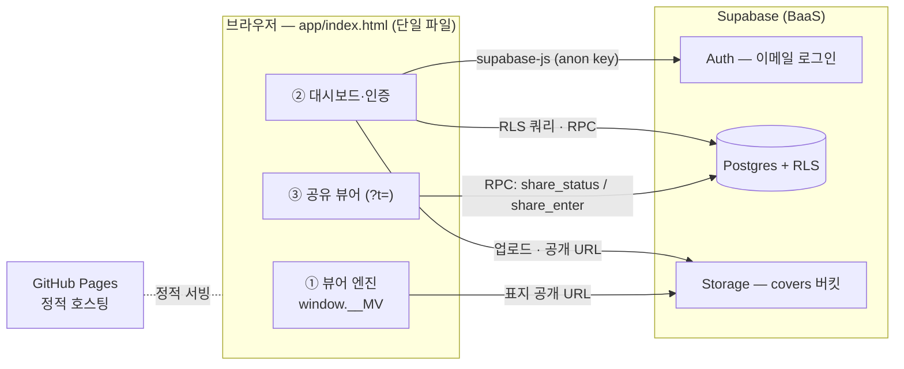
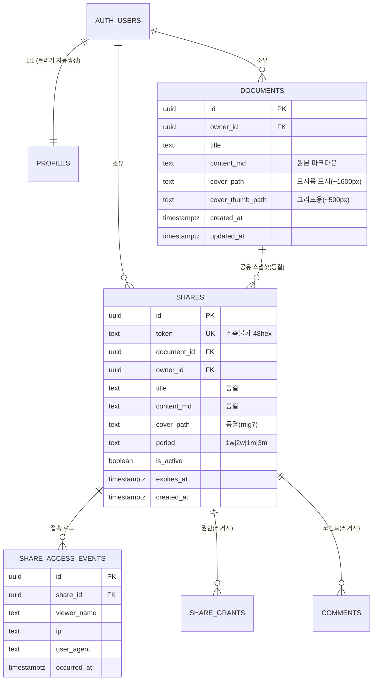

# 미리봄(Miribom) 기술 명세서

> 작성일 2026-06-22 · 대상: 개발자(인수인계/리뷰용) · 기준 커밋 `33e0d84`(main, 운영 라이브)
> 한 줄 요약: **단일 HTML 파일 마크다운 뷰어 + Supabase(BaaS) 백엔드**, GitHub Pages 정적 호스팅.

---

## 1. 개요

미리봄은 **마크다운 원고를 "책"처럼 펼쳐 보여 주는 뷰어**다. 자체 파서가 YAML 머리말·장(章)·각주·표지·판권 같은 구조를 인식해 CSS 다단(multi-column) 조판으로 페이지를 나눠 보여 준다. 여기에 **로그인·내 서재 저장·표지·비공개 공유** 기능을 붙였다.

### 설계 원칙
| 원칙 | 내용 |
|---|---|
| 단일 파일 | 앱 전체가 `app/index.html` 하나(HTML+CSS+JS 인라인, 약 2,535줄). 빌드 단계 없음. |
| 원본 보존 | DB에는 **렌더된 HTML이 아니라 원본 마크다운**(`content_md`)만 저장. 표시는 항상 클라이언트 파서가 담당. |
| 보안은 가볍게 | 원고 텍스트는 RLS로 비공개. 표지 이미지는 공개 버킷(경로가 임의 uuid라 사실상 비공개). 공유 "이름 입력"은 인증이 아니라 식별. |
| 정적 호스팅 | 서버 코드 없음. Supabase BaaS(Auth·Postgres·Storage) + GitHub Pages. |

### 기술 스택 (한눈에)
| 영역 | 사용 |
|---|---|
| 프론트 | 순수 HTML/CSS/JS (프레임워크·번들러 없음). CSS 다단 조판. |
| 백엔드 | Supabase — Auth(이메일), Postgres(+RLS), Storage. |
| 외부 라이브러리 | `@supabase/supabase-js@2` (jsDelivr CDN) 하나뿐. |
| 호스팅 | GitHub Pages (`main` 브랜치 서빙). |
| 설정 주입 | `config.js`(전역 `window.MIRIBOM_CONFIG`) — URL + anon(publishable) key. |

---

## 2. 시스템 아키텍처



### 두 가지 접근 흐름

**작성자(로그인 사용자)**
1. 이메일 로그인 → `documents`·`shares` 등은 RLS로 본인 행만.
2. `.md` 업로드 → `documents.insert`(원본 마크다운 저장).
3. 카드 클릭 → `__MV.loadManuscript(content_md, 표지URL, 제목)` 로 뷰어 렌더.
4. 표지 올리기 → 브라우저에서 리사이즈 후 `covers` 버킷 업로드 → 경로를 `documents`에 저장.
5. 공유 → `create_share_link` RPC가 그 순간 원고를 **동결 복사**한 `shares` 행 생성 → 토큰 URL 전달.

**공유 링크 방문자(비로그인)**
1. `…/app/index.html?t=<token>` 접속 → 앱이 `?t=` 감지 → **공유 뷰어 모드**(③ IIFE)로 전환.
2. `share_status(token)` → 유효하면 "이름 입력 화면"(공유자·제목·기간 표시), 무효면 "만료 화면".
3. 이름 제출 → `share_enter(token, name)` → 접속 로그 1건 기록 + 동결 본문/표지 반환 → 읽기 전용 렌더.

---

## 3. 저장소 · 브랜치 · 배포 · 환경

### 파일 구조
```
miribom/
├─ index.html                  # V1.0 — 백엔드 없는 원본 뷰어. 보존(안 건드림). 태그 checkpoint-1
├─ app/
│  └─ index.html               # V1.1 — 운영 앱(연동 기능 전부). 모든 작업은 여기
├─ config.js                   # SUPABASE_URL + anon key (커밋됨 — publishable 키만)
├─ .env                        # 비밀값(service key·DB URL) — gitignore, 현재 비어 있음
├─ supabase/
│  ├─ README.md                # (옛 설계 기준 — 본 문서가 최신)
│  └─ migrations/              # SQL 7개 (DB의 진실의 원천)
└─ *.md                        # 사용자 설명서·기획서·인계문서 등
```

### 브랜치 & 배포
- `main` = 운영 + V1.0. GitHub Pages가 이 브랜치를 서빙.
  - 운영 앱 주소: **`goraeahn.github.io/miribom/app/index.html`**
  - 루트 `/` = V1.0(백엔드 없는 원본 뷰어).
- `v1.1` = 작업 브랜치. 모든 개발은 여기 → 검증 후 `main`에 **fast-forward 머지**로 배포.
  ```bash
  git checkout main && git merge --ff-only v1.1 && git push origin main && git checkout v1.1
  ```

### 환경 설정 주입
- `app/index.html`이 `<script src="../config.js">`로 루트 `config.js`를 읽음 → `window.MIRIBOM_CONFIG = { SUPABASE_URL, SUPABASE_ANON_KEY }`.
- anon(publishable) 키는 공개해도 안전(모든 접근은 RLS가 통제)하므로 `config.js`는 **커밋**. service key·DB URL은 `.env`(gitignore, 현재 미사용).
- 외부 의존성: `@supabase/supabase-js@2` (jsDelivr). 그 외 빌드/패키지 없음.

> 설정이 없으면(`hasSB=false`) 앱은 **뷰어 단독 모드**로 동작(로그인·서재 없이 로컬 파일 읽기만).

---

## 4. 프론트엔드 구조

`app/index.html` 한 파일 안에 **최상위 파서 함수들 + 3개의 IIFE**가 들어 있다.

### 4-1. 문서 골격
```
<head> … 인라인 <style>(테마 변수·조판·대시보드·표지·공유 화면 전부)
<body>
  .wordmark(로고) + 헤더 도구막대(정보/목차/보기/테마/로그인/로그아웃)
  .stage > .book > .flow(조판 영역) + #book-bleed(표지 오버레이) + 진행바
  #empty(랜딩) · #dashboard(서재) · 각종 모달(인증/공유) · #share-gate·#share-expired
  <script src="../config.js">
  <script src="…supabase-js@2">
  <script> 최상위 파서 함수들 + IIFE ①②③ </script>
```

### 4-2. 최상위 파서 (IIFE 밖, 약 ~1588줄까지)
순수 함수 모음. 마크다운 → 구조화된 HTML.

| 함수 | 역할 |
|---|---|
| `parseYAML(md)` | 앞쪽 `--- … ---` 머리말 분리 → `{meta, rest}` |
| `parseBlocks(text)` | 블록 파싱(제목·문단·인용·목록·표·`::: 구획` 등) |
| `labelLookup(label)` | `::: 표지` 등 한글 이름표 → `[type, matter]` 매핑 (`LABELS` 테이블) |
| `buildAutoFront(meta)` | YAML로 자동 속표지·판권 생성 |
| `renderBlockList(...)` | 블록 → HTML(구조 역할·각주·랜드마크 부여) |
| `renderInline(s)` | 인라인(굵게·기울임·링크·각주·``→플레이스홀더) |
| `assemble(md)` | **파서 진입점**. 위를 조합 → `{ meta, bookTitle, autoFront, bodyHTML, endnotesHTML, landmarks, footnotes }` |

- 특별 구획은 `<section class="sp-*" epub:type="…" data-matter="front|body|back">`로 렌더. `data-matter`가 앞부속/본문/뒷부속을 구분(조판 분리에 사용).

### 4-3. 3개의 IIFE
| IIFE | 대략 위치 | 노출 | 책임 |
|---|---|---|---|
| ① 뷰어 엔진 | ~1589–2001 | `window.__MV = { loadManuscript, resetHome }` | 조판·페이지넘김·표지·목차·각주·테마·읽기 도구막대·배경 애니메이션 |
| ② 대시보드·인증 | ~2003–2457 | (내부) `sb` = supabase client | 로그인/회원가입·서재·업로드·표지·삭제·다운로드·공유 모달·사이드 메뉴 |
| ③ 공유 뷰어 | ~2459–끝 | (내부) anon `sb` | `?t=` 모드: 이름 게이트·만료 화면·`share_enter`·noindex 주입, `__MV.loadManuscript` 재사용 |

### 4-4. 뷰어 엔진 렌더 파이프라인
```
loadManuscript(md, coverUrl, colorKey)
  → assemble(md)               # 마크다운 → autoFront/bodyHTML/landmarks…
  → STATE 채움
  → buildFlow()                # composeFlow + ensureCoverPage + markBodyStart + buildBleed
  → paginate()                 # sizeBook → CSS 다단 폭/높이 계산 → pageCount 산출
  → render()                   # 현재 페이지로 스크롤, 진행바·푸터·표지클래스 갱신
```
- **조판 핵심**: CSS 다단(multi-column). "페이지" = 칼럼 1개. "새 쪽으로" = `break-before: column`.
- `markBodyStart()`: 앞부속(front) 다음 **본문 첫 블록**에 `break-before:column` 부여(제목이 없어도 새 쪽에서 시작).
- `SETTINGS`(글꼴·판형·여백·쪽배치·테마·각주모드) / `STATE`(현재 원고·페이지·표지·랜드마크 등) 두 객체로 상태 관리.
- 모바일(≤640px)은 박스 없는 **풀화면 페이지넘김**(가운데 탭 = 메뉴 토글). 데스크탑은 책 박스.

---

## 5. 데이터 모델 (ERD)

> **현행**(운영에서 쓰는 것)과 **레거시**(초기 설계 흔적, 현 UI 미사용)가 공존한다. 아래 ERD는 현행 중심.



---

## 6. DB 테이블 명세

### 6-1. `documents` — 작업 원고 (현행 핵심)
| 컬럼 | 타입 | 비고 |
|---|---|---|
| `id` | uuid PK | `gen_random_uuid()` |
| `owner_id` | uuid FK→auth.users | `on delete cascade` |
| `title` | text | 기본 '제목 없음'. 업로드 시 YAML title 또는 파일명에서 추출 |
| `content_md` | text | **원본 마크다운**(HTML 아님) |
| `cover_path` | text null | 표시용 표지 Storage 경로 (mig 6) |
| `cover_thumb_path` | text null | 그리드용 썸네일 경로 (mig 6) |
| `created_at` / `updated_at` | timestamptz | `updated_at`은 트리거 자동 갱신 |

- 인덱스: `documents_owner_id_idx`. 트리거: `documents_set_updated_at`, `documents_limit_before_insert`(20개 상한).

### 6-2. `shares` — 공유 스냅샷 (현행)
| 컬럼 | 타입 | 비고 |
|---|---|---|
| `id` | uuid PK | |
| `document_id` | uuid FK→documents | cascade |
| `owner_id` | uuid FK→auth.users | cascade |
| `token` | text UNIQUE | `encode(gen_random_bytes(24),'hex')` = 48자. **이 값을 아는 것이 곧 열람 권한** |
| `title`, `content_md` | text | 공유 시점 **동결 복사**(원고를 더 고쳐도 불변) |
| `cover_path` | text null | 공유 시점 표지 경로 동결 (mig 7) |
| `period` | text | 표시값 1w/2w/1m/3m (mig 4) |
| `is_active` | boolean | 회수 시 false |
| `expires_at` | timestamptz | period로 계산된 만료 시각 |
| `allow_comments` | boolean | 레거시(현 UI 미사용) |

### 6-3. `share_access_events` — 접속 로그 (현행, mig 4)
| 컬럼 | 타입 | 비고 |
|---|---|---|
| `id` | uuid PK | |
| `share_id` | uuid FK→shares | cascade |
| `viewer_name` | text | 입력한 이름(최대 120자) |
| `ip`, `user_agent` | text null | `share_enter`가 요청 헤더에서 베스트에포트 기록 |
| `occurred_at` | timestamptz | 읽기 시작(=이름 제출)마다 1건. 재방문도 새 행 |

### 6-4. `profiles` — 작가 프로필 (mig 1)
`id`(PK, FK→auth.users 1:1), `display_name`, `created_at`, `updated_at`. 가입 시 `handle_new_user` 트리거가 자동 생성(익명 로그인 제외). *현 UI는 적극적으로 쓰지 않음(이메일을 직접 사용).*

### 6-5. 레거시 테이블 (초기 설계, 현 UI 미사용 — 제거하지 않고 보존)
| 테이블 | 용도(당시) |
|---|---|
| `share_grants` | (share_id, user_id) — 익명 로그인+`redeem_share` 기반 옛 열람권한 |
| `comments` | 공유 스냅샷 익명 코멘트(작성/검열 RLS 포함) |
| `author_dashboard` (view) | 문서별 공유수·코멘트수 집계 (security_invoker) |

> 현행 공유는 **익명 로그인 없이** anon 키 + RPC(`share_enter`)로 동작하므로 위 3개는 호출되지 않는다. 정리(drop)는 별도 작업으로 남겨 둠.

---

## 7. 접근 제어 (RLS) 요약

모든 테이블 RLS 활성(기본 차단, 정책으로만 허용).

| 테이블 | 정책 | 효과 |
|---|---|---|
| `documents` | `documents_owner_all` | 읽기/쓰기/수정/삭제 전부 `owner_id = auth.uid()` |
| `shares` | `shares_owner_all` | 소유자 전권 |
| `shares` | `shares_select_granted` | (레거시) grant 보유자 select |
| `share_access_events` | `access_events_select_owner` | 해당 share 소유자만 로그 조회. 익명 직접 insert 불가 |
| `profiles` | own select/insert/update | 본인 프로필만 |
| `share_grants`/`comments` | (레거시 정책 다수) | 현 UI 미사용 |

- 역할: `anon`(비로그인) = 공유 RPC만 실행. `authenticated` = 로그인. 실제 접근은 RLS가 최종 통제.
- **비밀 토큰 검증을 RLS만으로 하면 행 열거 위험** → `SECURITY DEFINER` 함수로 처리(Supabase 표준 패턴).

---

## 8. 서버 함수 (RPC · 트리거)

### 8-1. 현행 공유 RPC (`SECURITY DEFINER`)
| 함수 | 호출 권한 | 동작 |
|---|---|---|
| `create_share_link(p_document_id uuid, p_period text='1m')` | authenticated | 호출자가 그 원고 소유자인지 확인 → 제목·본문·**표지경로**를 동결 복사 + period로 `expires_at` 계산 → `shares` insert → `{share_id, token, period, expires_at}` |
| `share_status(p_token text)` | anon·authenticated | 토큰 유효성(활성·미만료)만 판정. 유효하면 진입화면 메타(`title`, `sharer`=공유자 이메일, `period`, `expires_at`) 반환. **본문 미반환**. 없는 토큰도 `ok:false`(존재 비노출) |
| `share_enter(p_token text, p_viewer_name text)` | anon·authenticated | 빈 이름 거부 → 재검증 → 접속 로그 1건(이름+시각+베스트에포트 ip/ua) → `{ok, title, content_md, cover_path}` 반환 |

### 8-2. 트리거 함수
| 함수 | 트리거 | 동작 |
|---|---|---|
| `set_updated_at()` | profiles/documents BEFORE UPDATE | `updated_at = now()` |
| `handle_new_user()` | auth.users AFTER INSERT | 비익명 가입 시 `profiles` 자동 생성 |
| `enforce_document_limit()` | documents BEFORE INSERT | **사용자당 20개 초과 거부**(서버 강제 방어선) |

### 8-3. 레거시 함수
- `redeem_share(p_token)` — 익명 로그인 기반 옛 공유 교환(현 UI 미호출).

---

## 9. Storage — 표지 이미지 (`covers` 버킷, mig 6)

| 항목 | 값 |
|---|---|
| 버킷 | `covers` — **public read**, 2MB, `image/jpeg·png·webp` |
| 경로 규칙 | `covers/{owner_uid}/{document_id}/display.jpg` (표시용 ~1600px) + `…/thumb.jpg` (그리드용 ~500px) |
| RLS(storage.objects) | 읽기=공개 / insert·update·delete = `(storage.foldername(name))[1] = auth.uid()::text` (본인 폴더만) |
| 표시 | `sb.storage.from('covers').getPublicUrl(path)` — 비로그인 방문자도 공개 URL로 표지 표시 |
| 캐시버스터 | 교체 시 같은 경로 → `?v={updated_at}` 쿼리로 CDN 캐시 회피 |

- 업로드는 브라우저에서 canvas 리사이즈 후 2장(display/thumb) 업로드 → 경로를 `documents`에 저장.
- 원고/표지 삭제 시 Storage 객체도 함께 제거.
- 보안 판단: 경로가 임의 uuid라 URL을 모르면 접근 불가 → "공개 버킷이지만 사실상 비공개"로 취급(가볍게).

---

## 10. 기능 명세서

### 10-1. 인증
- 이메일+비밀번호 로그인/회원가입(단일 모달, 모드 토글). 헤더엔 **로그인 버튼만**(회원가입은 모달 안 "1초 만에 회원가입" 링크로 전환).
- `onAuthStateChange` → 로그인 시 `setAuthedUI` + `loadDocs` + 서재 표시 / 로그아웃 시 `setAnonUI` + 랜딩.

### 10-2. 서재(대시보드)
- 좌단(나의 서재) + 우측 사이드메뉴(나의 서재 / 공용 서재 / 이용 안내 / 자주 묻는 질문). 모바일은 하단 플로팅 메뉴.
- 콘텐츠 페이지(공용 서재·안내·FAQ)는 `<script type="text/plain">` 임베드 + 경량 `mdToHtml`로 렌더.
- 원고 카드: 3:4 표지, 우상단 원고지 매수 배지(200자=1매), 하단 업로드 일시, 롤오버 5버튼(뷰어/표지/공유/삭제/다운로드)+터치 `⋯`. 페이지네이션(한 페이지 N개).
- **로고 클릭 = 항상 "나의 서재"로**(공용 서재 등 어디서나). 읽는 중이면 확인 후 이동, 비로그인은 랜딩.

### 10-3. 업로드
- `.md` 드래그&드롭 또는 클릭 → `extractTitle`(YAML title 또는 파일명) → `documents.insert`. 20개 상한(클라이언트 + 서버 트리거 이중).

### 10-4. 표지(cover)
- "표지" 버튼 → 이미지 선택 → 브라우저 리사이즈(1600/500) → `covers` 업로드 → `cover_path`/`cover_thumb_path` 저장. 교체·제거 시 Storage 정리. (상세는 11장)

### 10-5. 뷰어(읽기 엔진)
- 책 펼침/페이지넘김, 목차·각주(팝업/미주), 정보(제목·지은이·표지 토글), 보기 패널(글꼴·판형·여백·쪽배치), 테마(day/sepia/night), 상단바 접기(몰입), 모바일 풀화면. iOS 사파리 안정화(`dvh`·`touch-action`·`overscroll`).

### 10-6. 공유
- 카드 → 공유 모달: 기간(1주/2주/한달/3달) 선택 → `create_share_link` → `…?t=토큰` URL 생성·복사. 활성 링크 목록·접속자(이름/시각) 현황·회수(`is_active=false`).
- 받는 사람: 이름만 입력하면 읽기 전용 열람(로그인·댓글·다운로드 없음). 본문은 **공유 시점 동결**. 공유 화면 전용 색(아이리스 #5651B8), noindex/no-referrer 주입.

---

## 11. 표지(cover) 시스템 상세

표지는 **대시보드 카드**와 **뷰어 첫 쪽**에서 같은 규칙으로 그려진다.

### 결정론적 색
- `colorIdx(title)`(대시보드) / `deepColor(title)`(뷰어) = `제목 글자코드 합 % 8`, 8색 깊은 팔레트(동일 배열). → **카드·뷰어·공유 표지색이 제목 기준으로 일치**.

### 규칙
| 상황 | 표시 |
|---|---|
| 공통 | 표지 쪽은 **항상 1개**(없으면 `ensureCoverPage`가 최소 표지쪽 삽입). `#` 제목 있으면 책제목 표시 |
| 이미지 있음(업로드) | 이미지를 배경 꽉차게. 작가가 쓴 `::: 표지` 블록 있으면 가운데 텍스트(스크림+흰글씨), 없으면 이미지만 |
| 이미지 없음 | 카드와 같은 색 배경 + 제목 위 짧은 선 + 제목(진하게) + 부제(제목 밑·명조·옅게) |
| 입체감 | 자동표지에 빛(좌상)+가장자리 음영+책등 그라데이션(양장본 느낌). 책등은 한 면 보기에서만 |

### 구현
- 뷰어: `#book-bleed` 오버레이(`.book` 절대배치 `inset:0`, 텍스트 z2 / 그라데이션 z1). 표지쪽일 때 `.book.cover-page`로 표시.
- 카드: `.card`의 `background`에 그라데이션 레이어(이미지 카드는 `:has(.card-cover)`로 제외).
- 본문 인라인 이미지 ``는 로드하지 않고 플레이스홀더 칩으로 표시.

---

## 12. 마이그레이션 목록 (`supabase/migrations/`)

| 파일 | 내용 | 상태 |
|---|---|---|
| `…0001_init_schema` | profiles·documents·shares·share_grants·comments 테이블, 트리거 | 적용됨 |
| `…0002_rls_policies` | RLS 정책 전반 + `redeem_share` + `author_dashboard` 뷰 | 적용됨(일부 레거시) |
| `…0003_document_limit` | 사용자당 20개 상한 트리거 | 적용됨 |
| `…0004_share_access` | `period` 컬럼 + `share_access_events` + `create_share_link`/`share_status`/`share_enter` | 적용됨 |
| `…0005_share_status_meta` | `share_status`에 공유자/제목/기간 메타 추가 | 적용됨 |
| `…0006_covers` | documents 표지 컬럼 + `covers` 공개 버킷 + Storage RLS | 적용됨 |
| `…0007_share_cover` | shares `cover_path` + 공유 RPC가 표지 동결/반환 | 적용됨(2026-06-22) |

> 적용은 Supabase SQL Editor에 붙여넣어 수동 실행(DB 자격증명은 작성자만 보유). `create or replace`/`if not exists`라 재실행 안전.

---

## 13. 레거시 · 제약 · 향후

**레거시(정리 대상, 동작엔 무해)**
- 초기 공유 설계(`redeem_share`·`share_grants`·`comments`·`author_dashboard`·익명 로그인)는 현 UI 미사용. `profiles`도 거의 미사용.
- `supabase/README.md`는 옛 설계 기준 — 본 문서가 최신.

**제약**
- 사용자당 원고 20개. 표지 2MB(jpg/png/webp). 공유 본문 동결(수정 미반영, 의도된 동작).
- 정적 호스팅이라 공유 URL은 `…/app/index.html?t=토큰`(경로형 `/v/{token}` 불가).
- `config.js`는 anon 키만 — DDL(마이그레이션)은 작성자가 수동 적용.

**향후 후보**
- 공용 서재(작가가 공개 선택한 원고) 실데이터 연동 — 현재 "준비 중" 안내 페이지.
- 레거시 테이블/뷰 정리, 커스텀 도메인(CNAME), 표지 EPUB 내보내기.

---

## 부록 — 빠른 점검(개발자용)

```bash
# 운영 앱
https://goraeahn.github.io/miribom/app/index.html
# 공유 링크 형태
https://goraeahn.github.io/miribom/app/index.html?t=<48hex-token>
# 자체 회귀 테스트(앞부속→본문 분리)
…/app/index.html?selftest=1   → 문서 제목이 [PASS]/[FAIL]
```
- 키 진입점: 파서 `assemble()` · 뷰어 `window.__MV.loadManuscript()` · 공유 `share_enter` RPC.
- DB 변경은 반드시 `supabase/migrations/`에 새 파일로(대시보드 수기 변경 금지).
