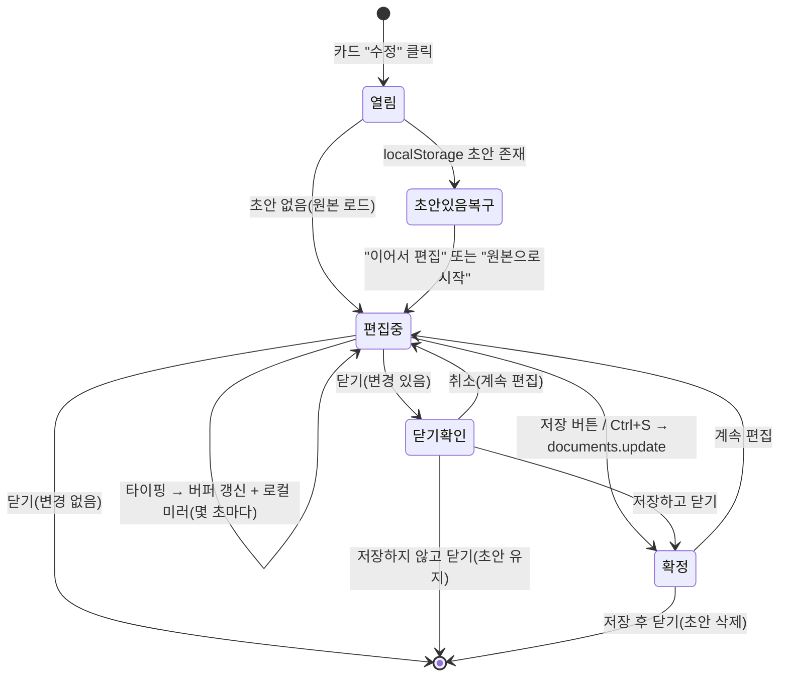

# 미리봄(Miribom) 인라인 편집기 기획서

> 작성일 2026-06-22 · 대상: 구현(Claude Code) / 검토(고래) · 기준: 운영 앱 `app/index.html`
> 한 줄 요약: **대시보드에서 띄우는 가벼운 인라인 마크다운 편집기.** 외부 에디터 라이브러리 없이 `<textarea>` + 기존 렌더러 재사용. 주 용도는 저자·출판사·판권 같은 머리말 수정과 오타 교정.

---

## 1. 목적과 범위

작가가 `.md`를 대충 올린 뒤, **저자·출판사·부제·판권 같은 책 정보와 오타 정도를 그 자리에서 고치는 것**이 전부다. 새 글을 길게 쓰는 본격 저작 도구가 아니다.

### 설계 결정
| 항목 | 결정 | 이유 |
|---|---|---|
| 에디터 라이브러리 | **쓰지 않음** | 어려운 부분(렌더러)은 `assemble()`·`loadManuscript()`로 이미 보유. 입력면은 순수 textarea면 충분 |
| 의존성 | **0개 추가** | 단일 파일·CDN 한 개(supabase-js) 원칙 유지 |
| 한글 입력 | 네이티브 textarea | CodeMirror류 IME 조합 버그 원천 차단 |
| 편집 위치 | **대시보드에서 오버레이로** | 뷰어(읽기 UI)에는 편집 컨트롤을 넣지 않음 |
| 미리보기 | 기존 뷰어 엔진 `__MV` 재사용 | 두 번째 렌더러를 만들 필요 없음 |

### 명시적 제외 (이번 범위 아님)
- 이미지 삽입 UI, 링크 삽입 UI (본문 인라인 ``는 어차피 뷰어에서 플레이스홀더 칩으로만 표시)
- 문서 복제/사본 생성 (사본이 필요하면 기존 **다운로드** 기능 사용)
- WYSIWYG, 협업 편집, 버전 히스토리

---

## 2. 화면 구성

대시보드 위에 뜨는 **전체화면 분할 오버레이**. 왼쪽 편집 패널, 오른쪽 읽기 전용 미리보기.

```
┌──────────────────────────── 편집 오버레이 ────────────────────────────┐
│  [상태표시: 저장됨·방금 / 수정함·저장 안 됨]              [저장]  [닫기] │
├───────────────── 편집 패널(좌) ─────────────────┬──── 미리보기(우) ────┤
│  ▸ 책 정보 폼                                    │                      │
│    제목 / 부제 / 저자 / 출판사 / 발행일 / 판권    │   기존 .book 스테이지 │
│    [표지 이미지 …] (기존 표지 업로드 흐름 재사용) │   __MV.loadManuscript │
│  ───────────────────────────────────────────── │   (디바운스 렌더)     │
│  ▸ 본문 (textarea)  ← 오타 교정용                │                      │
└─────────────────────────────────────────────────┴──────────────────────┘
```

- **오른쪽은 "뷰어에서 편집"이 아니다.** 편집 컨트롤은 전부 왼쪽에 있고, 오른쪽 책은 읽기 전용 미리보기일 뿐이다. (= 고래가 원한 분리)
- **모바일**: 분할 대신 `편집 / 미리보기` 탭 토글.

### 2-1. 책 정보 폼 (이번 편집기의 주 기능)
앞쪽 YAML 머리말 필드를 칸으로 노출해, 작가가 YAML 문법을 직접 만지지 않게 한다. `buildAutoFront()`이 실제로 읽는 필드와 1:1 대응:

| 폼 라벨 | YAML 키 | 비고 |
|---|---|---|
| 제목 | `title` | 저장 시 카드 제목·자동표지색에 반영(아래 4-3) |
| 부제 | `subtitle` | |
| 저자 | `author` | |
| 출판사 | `publisher` | |
| 발행일 | `date` | |
| 식별자 | `identifier` | (선택) |
| 판권 | `rights` | |

- 폼 값 → 저장 시 머리말로 다시 합성해 `content_md`에 기록.
- **예외 처리**: 작가가 YAML 대신 본문에 `::: 표지` / `::: 판권` 블록을 직접 썼다면, 그 블록은 본문 textarea에 그대로 남고 폼은 비어 있을 수 있다. 폼은 **YAML 머리말만** 다룬다(본문 `:::` 블록은 본문 textarea에서 수정).

### 2-2. 표지 이미지 (별도 저장 경로)
표지 **이미지**는 폼의 텍스트 필드가 아니라 기존 흐름을 그대로 재사용한다: 이미지 선택 → 브라우저 canvas 리사이즈(1600/500) → `covers` 버킷 업로드 → `documents.cover_path`/`cover_thumb_path` 갱신. 이 경로는 `content_md`와 무관하며, 아래 3장 저장 모델(초안/확정)과 **별개로 즉시 반영**된다.

### 2-3. 본문 textarea
오타 교정용 순수 textarea 하나. 툴바는 최소화하거나 두지 않는다. 이미지·링크 버튼 없음.

---

## 3. 저장 모델 (핵심)

> 사람들은 글을 고칠 때 망설이며 이것저것 건드려보다 마음에 안 들면 닫는다. "닫으면 자동 확정"은 그 중간 상태로 원본을 덮어쓰므로 **쓰지 않는다.** 작업 버퍼와 DB 원본을 분리하는 것이 이 설계의 뼈대다.

### 원칙
1. **확정은 명시적으로만.** DB 갱신(`documents.update`)은 사용자가 **저장 버튼 또는 Ctrl/Cmd+S**를 누를 때만. 그 전까지 DB 원고는 손대지 않는다.
2. **로컬 초안은 충돌 대비용.** 편집 중 버퍼를 몇 초마다 `localStorage`(문서 id 키)에 미러링. 탭이 꺼지거나 실수로 닫힌 경우만 대비. **DB도 아니고 원고도 아니고 복제도 아니다** — `documents` 행은 원고당 하나 그대로.
3. **닫을 때 조용히 확정하지 않는다.** 변경이 있으면 3갈래로 묻는다.
4. **다음에 열 때 초안을 복구한다.** 저장 안 하고 닫았어도 작업이 사라지지 않는다.

### 상태 흐름


### 닫기 동작
- 변경 없음 → 즉시 닫힘.
- 변경 있음 → **저장하고 닫기 / 저장하지 않고 닫기 / 계속 편집** 3갈래. 어느 쪽도 모르는 새 원본을 바꾸거나 작업을 통째로 날리지 않는다.

### 초안 복구
- 저장 안 하고 닫았는데 로컬 초안이 있으면, 다음에 그 원고 편집기를 열 때: **"지난번 편집하던 내용이 있습니다 — 이어서 편집 / 원본으로 시작."**
- 초안 삭제 시점: 명시 저장 성공 시 / "원본으로 시작" 또는 "버리기" 선택 시 / **로그아웃 시**(미공개 원고가 localStorage에 남지 않도록).

### 상태 표시
화면 구석에 현재 상태를 항상 표시: `저장됨 · 방금` ↔ `수정함 · 저장 안 됨`. 자동저장이 곧 확정인 것처럼 보이던 모호함을 없앤다.

---

## 4. 데이터 흐름

### 4-1. 열기
1. 카드 "수정" 클릭 → 그 문서의 `content_md`로 오버레이 오픈. (카드가 이미 `content_md`를 들고 있으면 추가 조회 없이 재사용)
2. `parseYAML(content_md)` → `{ meta, 본문 }`로 분리 → 폼·textarea에 채움.
3. `localStorage`에 해당 id 초안이 있으면 복구 안내(3장).

### 4-2. 편집 중 미리보기
- 폼/본문 변경 → **디바운스(약 500ms 멈춤)** 후 머리말+본문 재합성 → `assemble()` → `__MV.loadManuscript(...)`로 오른쪽 렌더.
- 재조판(`paginate()`)이 무거우므로 매 타건이 아니라 **입력이 멈춘 뒤에만** 갱신.

### 4-3. 확정(저장)
- 폼+본문 → 머리말 재합성 → 새 `content_md` 생성.
- `extractTitle(content_md)` 재실행 → `documents.update({ content_md, title }).eq('id', docId)` 한 번.
- **제목이 바뀌면 자동표지색도 바뀐다**(색은 `colorIdx`/`deepColor`가 제목 기준으로 그때그때 계산 — 저장값 아님). 의도된 동작.
- 성공 시 카드 갱신(제목·표지색·`updated_at`) + 로컬 초안 삭제.

### 4-4. 접근 제어
- `documents.update`는 기존 RLS `documents_owner_all`(`owner_id = auth.uid()`)이 이미 막는다. **새 정책 불필요.**
- 공유본은 링크 생성 시점 동결 스냅샷이라, 원고를 어떻게 고쳐도 이미 뿌린 링크엔 영향 없음.

---

## 5. 진입점(UI)

- 카드 롤오버 버튼에 **✎ 수정** 1개 추가 (현재 뷰어·표지·공유·삭제·다운로드 5개 → 6개).
- 터치 환경에선 `⋯` 메뉴 안에.

---

## 6. 보안 게이트에 추가할 항목

기존 "실원고 업로드 전 보안 테스트 통과" 게이트에 **update 경로 2건**을 추가(정책 변경 없이 테스트만 증가):
1. 비로그인 사용자가 임의 문서를 `update` 할 수 없을 것.
2. 계정 B가 계정 A의 문서를 `update` 할 수 없을 것.

---

## 7. 작업 분담

| 주체 | 항목 |
|---|---|
| **고래(직접)** | 카드 "수정" 버튼 위치·아이콘 확정, 폼 항목/라벨 확정, 상태표시·3갈래 확인·초안복구 문구 확정 |
| **Claude Code(위임)** | 오버레이 마크업/CSS, `parseYAML` 분해 ↔ 폼 바인딩 ↔ 머리말 재합성, 디바운스 미리보기 렌더, localStorage 초안 미러/복구, 닫기 3갈래 로직, `documents.update` 연결, 표지 업로드 흐름 재사용 연결, update 보안 테스트 2건 |
| **검증** | ① 한글 조합 입력 중 로컬 미러가 글자를 끊지 않는지 ② 긴 원고에서 재조판 디바운스가 버벅이지 않는지 ③ 저장 안 하고 닫은 뒤 재오픈 시 초안 복구 정상 ④ 로그아웃 시 초안 정리 확인 |

---

## 8. 엣지 케이스 메모

- **머리말 없는 `.md`**: 폼은 비어 있고, 저장 시 새 머리말이 본문 위에 생성된다. 사용자가 의도치 않게 머리말이 붙는 느낌을 줄 수 있으니, 빈 필드는 기록하지 않는다(값 있는 키만 직렬화).
- **본문에 직접 쓴 `::: 표지`/`::: 판권`**: 폼이 아니라 본문 textarea에서 수정(2-1 예외). 폼과 본문 블록이 동시에 같은 정보를 가질 수 있음은 기존 파서 동작(`existing` 집합으로 자동 머리말 억제)이 처리.
- **표지 변경 vs 텍스트 편집**: 표지 이미지는 즉시 반영(별도 경로), 텍스트는 명시 저장 후 반영. 사용자에게 "표지는 바로 저장됨"이 헷갈리지 않도록 표지 버튼 옆에 짧은 안내.
- **재조판 성능**: 노벨 길이 원고에서 디바운스만으로 부족하면, 미리보기 갱신을 "수동 새로고침" 버튼으로 전환하는 옵션을 후속 과제로 남김.
